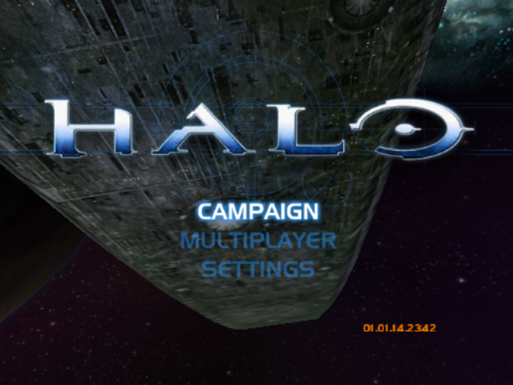
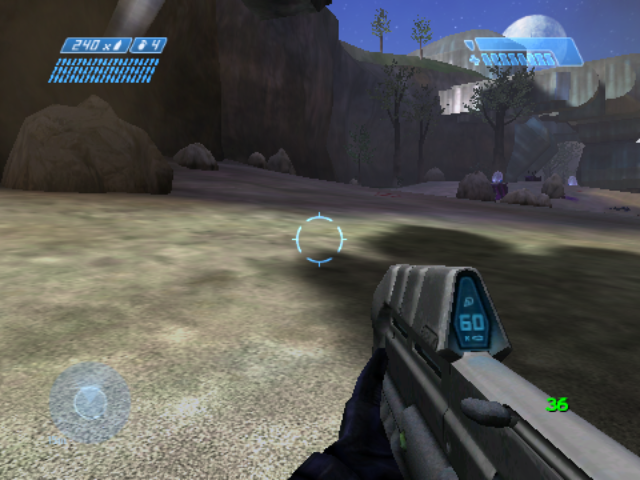

# Halo: Combat Evolved on Anbernic RG35XX H — native port for Knulli (Allwinner H700)

Yes — Halo CE runs natively on the Anbernic RG35XX H (RG35XXH) under Knulli:
60 fps in the menus and about 40 to 55 fps in campaign levels at the default
render scale. This repository is a native ARM64 (AArch64) port of the Halo:
Combat Evolved decompilation, [halo-ce-universal](https://github.com/cybersecurity/halo-ce-universal),
to the Allwinner H700 and its Mali-G31 GPU. There is no emulation: no xemu,
no Box64, no Wine. You need your own copy of the original Xbox game. This
repository contains source code and documentation only.

- Game: Halo: Combat Evolved, Xbox build 01.01.14.2342, decompiled to C.
- Target: Anbernic RG35XX H and other Allwinner H700 retro handhelds running
  Knulli (a Batocera fork), release Gladiator II.
- Status: tested in the menus and in the a30, b30 and c10 campaign levels;
  performance work is ongoing.
- Licence: CC0 1.0, like upstream.

## Contents

- [Screenshots](#screenshots)
- [Features](#features)
- [Performance](#performance)
- [Supported devices](#supported-devices)
- [Requirements](#requirements)
- [Install](#install)
- [Build from source](#build-from-source)
- [How it works](#how-it-works)
- [Documentation](#documentation)
- [Configuration](#configuration)
- [Troubleshooting](#troubleshooting)
- [FAQ](#faq)
- [Legal notice](#legal-notice)
- [Credits](#credits)

## Screenshots

Captured on an Anbernic RG35XX H (640x480 screen).

| Main menu | The Silent Cartographer (b30), render scale 0.75 |
| --- | --- |
|  |  |

## Features

- Native AArch64 code for the game and the host. The CPU runs the game's own
  logic compiled for ARM64; nothing is translated or emulated.
- Uses the firmware's own SDL2 and Arm's Mali-G31 OpenGL ES driver on the
  framebuffer, so it runs on stock Knulli with no extra libraries.
- A dedicated GL thread takes the Mali driver's per-draw CPU cost (about
  17 µs a draw call) off the game's core.
- Renderer changes for a tile-based mobile GPU: program binary cache, fp16
  shaders, 16-bit textures, asynchronous occlusion readback, quad batching and
  decal ordering, model LOD scaling, and shadows restructured to avoid
  render-target switches.
- Adjustable render scale (default 0.75, 480x360 scaled to 640x480).
- CPU and GPU clocks pinned while the game runs and restored on exit.
- First launch extracts `maps/` from your Xbox disc image on the handheld.
- The handheld's own controls, read from EmulationStation's configuration.
- Quit with the hotkey: hold MENU (or SELECT) and press START.

## Performance

Frames per second on an Anbernic RG35XX H, Knulli Gladiator II, stock thermal
limits, measured with `HALO_FPS_LOG` over the opening of each level. The b30
battle varies from run to run by 2 or 3 fps.

<!-- performance table: update the numbers and the date here as optimisations land -->
Last updated: 2026-09-30.

| Scene | `render_scale = 0.75` (480x360, default) | `render_scale = 1.0` (640x480) |
| --- | --- | --- |
| Main menu | 60 | 60 |
| c10, 343 Guilty Spark (swamp) | about 44 | 26 |
| b30, The Silent Cartographer (beach battle) | about 40 (35–46) | 26 |
| a30, Halo (level opening) | about 55 | 20 |
<!-- end of performance table -->

The 640x480 column was measured on an earlier build and is being re-measured.

At 640x480 the GPU's pixel and vertex work is the limit. At 0.75 the limit is
the Mali driver's CPU time for each draw call on the GL thread. The kernel's
thermal governor lowers the clocks at 70 °C. The history of the
optimisations and the measurements behind them are in
[docs/PERFORMANCE.md](docs/PERFORMANCE.md).

## Supported devices

The port needs an Allwinner H700 (4x Cortex-A53 at 1.5 GHz, Mali-G31 MP2,
1 GB RAM) running Knulli.

| Device | Screen | Status |
| --- | --- | --- |
| Anbernic RG35XX H | 640x480 | Tested |
| Anbernic RG35XX Plus | 640x480 | Untested, expected to work |
| Anbernic RG35XX SP | 640x480 | Untested, expected to work |
| Anbernic RG35XX 2024 | 640x480 | Untested, expected to work |
| Anbernic RG40XX H | 640x480 | Untested, expected to work |
| Anbernic RG40XX V | 640x480 | Untested, expected to work |
| Anbernic RG CubeXX | 720x720 | Untested |
| Anbernic RG34XX | 720x480 | Untested |

TrimUI handhelds and devices with other SoCs are not supported: they have
different GPUs and drivers. Other firmware on the H700 (muOS, ROCKNIX) is
untested. If you try another device or firmware, please open an issue with
the result and the `halo/log.txt`.

## Requirements

- An H700 handheld with Knulli (tested with Gladiator II).
- Your own disc image of Halo: Combat Evolved for the original Xbox (`.iso`
  or `.xiso`). The Xbox version's maps are required; the PC version's files
  do not work.
- About 2 GB free on the card for the extracted `maps/`, plus room for the
  disc image during the first launch.
- The built files: `halo`, `halo_guest.elf`, `Halo.sh`, `halo_extract.py`
  and `sdl_mapping.py`. This repository does not ship binaries; build them
  as described in [Build from source](#build-from-source).

## Install

1. Copy `halo`, `halo_guest.elf`, `halo_extract.py` and `sdl_mapping.py`
   into `/userdata/roms/ports/halo/` on the handheld.
2. Copy `Halo.sh` into `/userdata/roms/ports/`.
3. Put your Xbox Halo disc image (`.iso`) in `/userdata/roms/ports/halo/`.
4. Launch Halo from Ports. Refresh the game list if it does not appear.
   The first launch extracts `maps/` from the image, which takes a few
   minutes; the image can be deleted afterwards. Instead of an image you can
   also copy an extracted Xbox `maps/` folder into `halo/`.
5. To quit, hold the hotkey (MENU, or SELECT) and press START.

The resulting layout:

```
/userdata/roms/ports/
├── Halo.sh
└── halo/
    ├── halo
    ├── halo_guest.elf
    ├── halo_extract.py
    ├── sdl_mapping.py
    ├── config.toml      written at the first launch
    ├── log.txt          the log of the last launch
    ├── maps/            extracted from your disc image
    └── save/            saved games and the shader cache
```

The first time each shader combination is used, the driver compiles it, on
a thread of its own: what it draws appears a moment late, rather than the
game stopping for it. The compiled programs are kept in `halo/save/shaders`,
so later launches load them instead.

## Build from source

The build runs on Linux x86-64. It was done on Ubuntu 24.04 under WSL.

### Tools

- Ubuntu 24.04 (WSL works), `python3`, `ninja-build`, `git`, `curl`.
- clang 22 from [apt.llvm.org](https://apt.llvm.org/): the guest is compiled
  for the `arm64_32` (ILP32 AArch64) target.
- Android NDK r28c: it builds the guest and provides the GLES and EGL headers.
- `gcc-aarch64-linux-gnu` (13.x): the host, an ordinary aarch64 glibc program.
- SDL2 headers from the SDL `release-2.30.12` tag. `build.sh` downloads them.

```sh
sudo apt install python3 ninja-build git curl gcc-aarch64-linux-gnu
wget https://apt.llvm.org/llvm.sh && sudo bash llvm.sh 22
curl -LO https://dl.google.com/android/repository/android-ndk-r28c-linux.zip
unzip -q android-ndk-r28c-linux.zip
```

### The device's libraries

The host links against the handheld's own `libSDL2-2.0.so.0` and
`libmali.so.0` (Arm's driver, which provides OpenGL ES and EGL). Copy them
from the handheld's `/usr/lib` into a `sysroot/` folder. They are used only
at link time and must not be committed.

```sh
mkdir -p sysroot
scp 'root@<handheld>:/usr/lib/libSDL2-2.0.so.0*' 'root@<handheld>:/usr/lib/libmali.so.0*' sysroot/
# or: adb pull /usr/lib/libSDL2-2.0.so.0 sysroot/ ; adb pull /usr/lib/libmali.so.0 sysroot/
```

### Build

```sh
ANDROID_NDK=$PWD/android-ndk-r28c SYSROOT_LIB=$PWD/sysroot ./build.sh
```

`build.sh`:

1. clones [halo-ce-universal](https://github.com/cybersecurity/halo-ce-universal)
   into `work/halo-ce-universal` and checks out the commit in
   `UPSTREAM_COMMIT`;
2. applies `patches/halo-ce-universal-knulli.patch` and copies `port/knulli`
   into the upstream tree;
3. downloads the SDL2 2.30.12 headers into `work/`;
4. runs `python3 configure.py --release --android-ndk <ndk> --android-guest-cc clang-22`
   (the first time; it downloads musl and SDL3 for the guest), then
   `port/knulli/build.sh`;
5. copies `halo`, `halo_guest.elf`, `Halo.sh`, `halo_extract.py` and
   `sdl_mapping.py` into `dist/`.

The first build takes 10 to 30 minutes; later builds are incremental.
Optional variables: `GUEST_CC` (default `clang-22`), `HOST_CC` (default
`aarch64-linux-gnu-gcc`), `WORK`, `DIST`, `JOBS`.

## How it works

The upstream project decompiled Halo CE's Xbox build to C and ported it to
Linux, Windows and Android. Its Android port compiles the game as an ILP32
AArch64 "guest image" (32-bit pointers, as on the Xbox, in 64-bit ARM code)
that a small host program loads and serves.

This port reuses that guest image and adds a new host for Knulli in
`port/knulli/`: an aarch64 glibc Linux program instead of an Android app. It
answers the guest's SDL3 calls with the firmware's SDL2, the only SDL with
the Mali framebuffer video driver, and runs the guest's OpenGL ES calls on a
GL thread. The renderer changes for the Mali-G31 are in the patch against
upstream (`port/linux/src` and `source/`).

Details: [docs/HOW-IT-WORKS.md](docs/HOW-IT-WORKS.md) and
[port/knulli/README.md](port/knulli/README.md).

## Documentation

The [documentation index](docs/README.md) describes each document and
suggests a reading order for players, builders and developers.

- [Install](docs/INSTALL.md): the player's guide, from copying the files to
  the controls, the saves and what the launcher does to the clocks.
- [Configuration](docs/CONFIGURATION.md): every setting and `HALO_*`
  variable, with its default and effect.
- [Building](docs/BUILDING.md): building from source, step by step, with the
  common build errors.
- [How it works](docs/HOW-IT-WORKS.md): the architecture in brief.
- [Architecture](docs/ARCHITECTURE.md): the guest and the host, the GL
  thread, the renderer and the rasterizer changes in depth.
- [Performance](docs/PERFORMANCE.md): the optimisation history and its
  measurements.
- [Profiling](docs/PROFILING.md): the measuring tools and how to read them.
- [Mali-G31 notes](docs/MALI-G31-NOTES.md): lessons for porting a
  Direct3D-era renderer to this GPU.
- [Contributing](docs/CONTRIBUTING-DEV.md): how to change the code and
  benchmark a change.
- [Roadmap](docs/ROADMAP.md): current limits and planned work.
- [FAQ](docs/FAQ.md) and [legal notice](docs/LEGAL.md).

## Configuration

The settings are in `halo/config.toml`, written at the first launch. The
launcher's defaults for the handheld:

| Setting | Default | Effect |
| --- | --- | --- |
| `display.render_scale` | `0.75` | The 3D picture's resolution as a fraction of the screen's, 0.5 to 1.0, scaled up at the end of the frame. Lower is faster. |
| `display.model_detail` | `0.5` | How early objects switch to their simpler models (1.0 is the game's own switch point), multiplied by the render scale. |
| `display.fast_shaders` | `true` | Colours and combiner arithmetic in half precision (fp16). |
| `display.fast_textures` | `true` | DXT1 and 16-bit Xbox textures sent to the GPU as 16-bit texels. |
| `display.screen_width` | `640` | The columns of the 480-line picture (640 for the Xbox's 4:3). |
| `display.interpolation` | `true` | Draws a frame for every display refresh, blending between the game's 30 ticks a second; `false` keeps 30 fps. |
| `display.vsync` | `true` | Waits for the display between frames. |
| `update.auto` | `false` | The upstream updater, which fetches upstream's builds rather than this port's; off. |
| `network.online` | `false` | Internet play through invite links; off. |

Environment variables such as `HALO_RENDER_SCALE=0.6` override a setting for
one run. Every setting is described in
[docs/CONFIGURATION.md](docs/CONFIGURATION.md), and the `debug.*` settings and
the profiling variables also in
[port/knulli/README.md](port/knulli/README.md#tools-for-performance-work).

A file `halo/init.txt` runs console commands at start-up, for example
`map_name levels\b30\b30` to start a level directly.

## Troubleshooting

- **Halo returns to the menu at once.** Read `halo/log.txt`. "no maps folder
  and no disc image" means `halo/` has neither `maps/ui.map` nor an `.iso`.
- **The first launch seems stuck.** Extracting `maps/` from the disc image
  takes a few minutes with a black screen. The log shows the progress.
- **The maps do not load.** The PC version's files do not work; use an Xbox
  disc image or an Xbox `maps/` folder.
- **The buttons are wrong.** `sdl_mapping.py` builds the SDL mapping from
  EmulationStation's controller configuration. Check that the handheld's
  controls are configured in EmulationStation.
- **Objects appear late the first time.** Each new shader combination is
  compiled once, beside the game, and cached in `halo/save/shaders`; what
  it draws is skipped until it is ready. Deleting that folder is safe; the
  programs are compiled again.
- **The frame rate drops after a while.** At 70 °C the kernel lowers the CPU
  and GPU clocks. Lower `display.render_scale` for more headroom.
- **The clocks stay high after a crash.** `Halo.sh` restores the CPU
  governor and the GPU's minimum clock on exit; a reboot restores them too.

## FAQ

### Can the Anbernic RG35XX H run Halo: Combat Evolved?

Yes. This port runs Halo CE natively on the RG35XX H under Knulli, as AArch64
code on the H700's Cortex-A53 cores with the Mali-G31 GPU. It is built from
the halo-ce-universal decompilation; you supply the Xbox game's data.

### What frame rate does Halo CE get on the RG35XX H?

At the default render scale of 0.75: 60 fps in the menus, about 44 fps on
343 Guilty Spark (c10), about 40 fps in the beach battle of The Silent
Cartographer (b30), and about 55 fps at the opening of Halo (a30). At
the full 640x480 it is 20 to 26 fps. The numbers are improving; see the
[performance table](#performance).

### Does it work with the Xbox version or the PC version of Halo?

The Xbox version. The decompilation is of the Xbox build, and it reads the
Xbox maps. The PC version (Gearbox's port) has different map files that this
code cannot load. Use a disc image of the original Xbox game.

### Is this legal?

The repository contains only source code and documentation: the upstream
decompilation's authors released their code under CC0, and so does this
port. It contains no game files, disc images, maps or binaries of the game.
You need your own copy of the Xbox game. Whether decompilation projects are
lawful depends on where you live; this is not legal advice. See the
[legal notice](docs/LEGAL.md).

### Does it need PortMaster?

No. It is a plain Knulli port: a launcher script in `roms/ports` and a
folder. It uses the firmware's own SDL2 and Mali driver and none of
PortMaster's runtimes.

### Does it work on muOS or ROCKNIX?

Untested. The host is built against Knulli's SDL2 (2.30.12) and Arm's
framebuffer Mali driver. Other firmware for the H700 may ship a different
graphics stack, which the host's SDL2 and EGL bridge would need to support.
Reports are welcome.

### Why not run the PC version with Box64 and Wine?

The PC version is a 32-bit x86 Windows program that draws with Direct3D 9.
Running it on the H700 would need x86 translation, Wine, and a Direct3D to
OpenGL ES translation layer, all on four Cortex-A53 cores and 1 GB of RAM.
Each layer costs CPU time the device does not have. The native port runs the
game's own logic as ARM64 code and draws with OpenGL ES directly.

### Why not use xemu?

xemu emulates the whole original Xbox, its Pentium III CPU and its NV2A GPU,
and needs a fast desktop CPU and a desktop OpenGL or Vulkan GPU. The H700's
Cortex-A53 cores and its OpenGL ES-only Mali driver are far below that. A
native port of the decompiled code avoids the emulation entirely.

### Which other handhelds does it work on?

It should work on the other Allwinner H700 handhelds that run Knulli: the
Anbernic RG35XX Plus, SP and 2024, RG40XX H and V, RG CubeXX and RG34XX.
Only the RG35XX H has been tested. TrimUI handhelds and other SoCs are not
supported.

## Legal notice

This is an unofficial fan project. It is not affiliated with, endorsed by or
sponsored by Microsoft, Xbox Game Studios, Halo Studios or Bungie. Halo,
Halo: Combat Evolved and Xbox are trademarks of Microsoft Corporation.

The repository contains no Halo game files: no disc images, maps, XBE,
extracted assets or prebuilt game binaries. It contains no Arm Mali driver
binaries and no device libraries. To play, you need your own copy of the
original Xbox game. Details: [docs/LEGAL.md](docs/LEGAL.md).

## Credits

- [halo-ce-universal](https://github.com/cybersecurity/halo-ce-universal)
  and its contributors: the decompilation's Linux, Windows and Android
  ports, on which this port is built. It starts from
  [bnunu/halo-1](https://github.com/bnunu/halo-1), a fork of
  [punpckhdq/halo](https://github.com/punpckhdq/halo).
- Bungie, who made Halo: Combat Evolved. Halo is a trademark of Microsoft
  Corporation.
- [SDL](https://www.libsdl.org/) (zlib licence): the headers are used at build
  time, and the firmware's SDL2 at run time.
- [Knulli](https://knulli.org/), the firmware for these handhelds, based on
  [Batocera](https://batocera.org/).
- The upstream build also uses [musl](https://musl.libc.org/), tomlc17 and
  miniupnpc, under their own licences.

## Licence

[CC0 1.0 Universal](LICENSE), like upstream. Contributions are welcome; see
[CONTRIBUTING.md](CONTRIBUTING.md).
